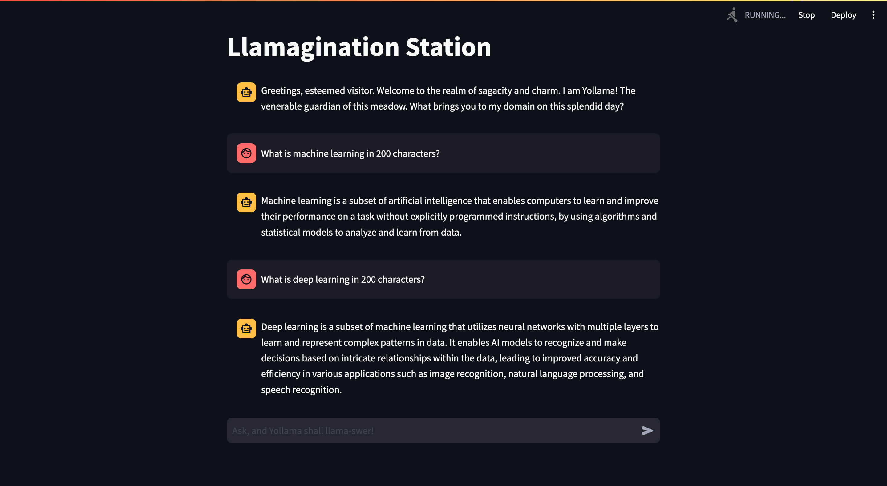

# Llama3 in MongoDB: Conversational QA App
A conversational chat interface where users can interact with the `Llama-3` language model, and the conversation history is logged in `MongoDB` for future reference.


## Features:

1. **Language Model Integration**:
        The app integrates the `Llama-3` language model (LLM) for natural language processing. The model is initialized with a specified `Ollama` model and a callback manager for handling streaming standard output.

2. **User Interface**:
        The app's user interface is created using `Streamlit`. Users can input messages through the chat input interface. User messages are displayed in the chat, and the messages are added to the chat history.

3. **Chat Initialization**:
        The app starts with an initial prompt in the chat in `Langchain`, displaying a greeting message. The chat history is initialized if it doesn't exist in the session state.

4. **MongoDB Integration**:
        The app connects to `MongoDB` `Atlas` server. It retrieves the collection name and displays chat messages from the database on app rerun. The messages are fetched and displayed in the chat history container.

5. **Response Processing**:
        The app processes user input by obtaining a response from the Ollama language model. The response is then displayed in the chat interface, and the messages are added to the chat history.

6. **Streaming Simulation**:
        The app simulates the streaming of the AI's response with a spinner to indicate processing. It adds a delay to simulate a more dynamic chat experience.

7. **MongoDB Logging**:
        All user and AI messages are inserted into the `MongoDB` collection for logging and retrieval.

## Demo:


## How to use
1. Install requirements:
```python
pip install -r requirements.txt
```
2. Install and run Ollama:
https://python.langchain.com/docs/integrations/llms/ollama
3. Fetch a model via `ollama pull <model family>`
e.g., for Llama-7b: 
```python
ollama pull llama3
```
4. Place your Environment variables in the `.env` file.
5. Run the app:
```python
streamlit run app.py
```
5. Visit http://localhost:8501 on your browser.

## Links:
1. **LangChain**: https://python.langchain.com/docs/get_started/introduction
2. **Ollama**: https://ollama.ai/library/codellama
3. **MongoDB**: https://www.mongodb.com
4. **Streamlit**: https://streamlit.io
